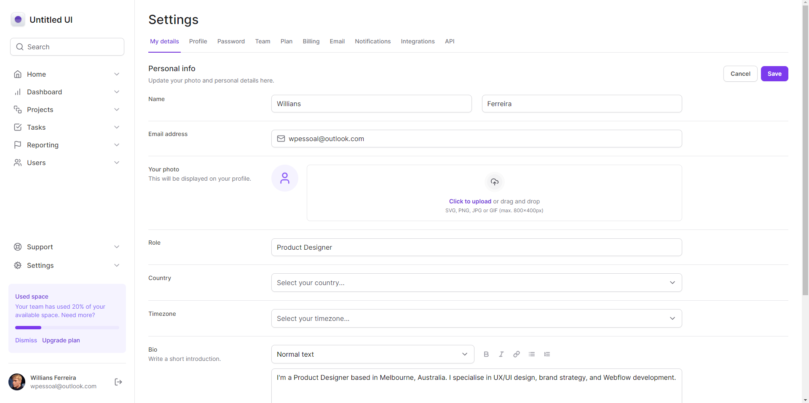

# Dashboard feito com NextJS e Tailwind

### Projeto feito para modelo de dashboard usando <strong>Next JS e Tailwind</strong> que pode ser usado para as mais variadas aplicações. O modelo já se encontra completamente responsivo.

<hr>

<p align="center">
  <a href="#-tecnologias-utilizadas">Tecnologias</a> -
  <a href="#-resultado-aplicação-web">Resultado WEB</a> -
  <a href="#-como-executar">Como executar</a>
</p>

<a id="-tecnologias-utilizadas"></a>

## Tecnologias utilizadas

### Algumas das tecnologias usadas no projeto.

<p align="center">
  
  
  
    
  
  
  
  
</p>

<a id="-resultado-aplicação-web"></a>

## Resultado Aplicação WEB



<p align="center">

<a id="-como-executar"></a>

## Como executar

Para executar a aplicação seguir os procedimentos abaixo:

-- Procedimento iniciar aplicação WEB --

- Acessar primeiro o diretório web com o comando

```bash
cd tailwind-dashboard
```

- Instalar as dependências da aplicação WEB

```bash
npm install
```

- Iniciar a aplicação web com o comando

```bash
npm run dev
```
